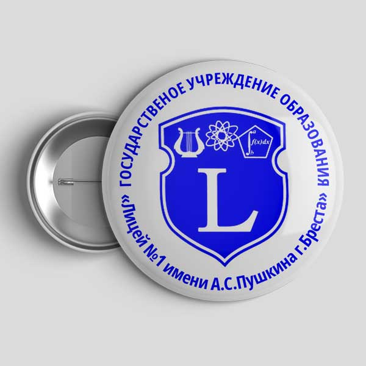

## 1. Full Name

Pavel Halanin


Middle Software Engineer

Work Experience 3 year

(JavaScript, React, React Native, Next.js, Node.js, NestJS, PHP, REST API, SwaggerUI, Docker, Git)

## 2. Contact information

- **Phone**: [+375-33-331-32-03](tel:+375333313203)
- **E-mail**: [pavelhalanin@outlook.com](mailto:pavelhalanin@outlook.com)
- **Discord**: [pavgal](https://discord.com/users/1482615972060991488)
- **GitHub**: [pavelhalanin](https://github.com/pavelhalanin)
- **LinkedIn**: [pavelhalanin](https://www.linkedin.com/in/pavelhalanin/)
- **CodeWars**: [rsschool](https://www.codewars.com/users/rsschool_7f3e087f4b5570c1)
- **WebSite**:
    - [OOO DE-PA](https://www.de-pa.by/)
    - [Kung Consulting](https://www.kungconsulting.com/)

## 3. Brief Self-Introduction

Software Engineer with 3 years of commercial experience, graduated with honors in Software Engineering. Began my career at DE-PA, then joined ATLANT, where I was promoted to Software Engineer 2nd Category within two years. Tech stack: JavaScript, React, React Native, Next.js, Node.js, NestJS, PHP, REST API, SwaggerUI, Docker, Git. Seeking a Middle Software Engineer position in a professional team with opportunities for further growth.

## 4. Skills

- programming languages: JavaScript, PHP8, SQL, TypeScript
- frameworks: React, ReactNative, NextJS, NestJS
- methodologies: ARIS, UML
- version control systems: Git, SVN
- IDE: VS Code
- Package Managers: npm, yarn
- Debugging Tools: Chrome DevTools
- Operating Systems: Windows, Linux
- API Testing: Postman, SwaggerUI
- Markup & Documentation Languages: HTML5, CSS3, MarkDown, LaTeX, JSON
- Databases: MySQL, Oracle, SQLite, DBF
- Containers & Virtualization: Docker, docker-compose
- Design: Figma, Photopea, Adobe Photoshop
- Hosting & Server Management: cPanel, ISPmanager, Hoster.by, Login.by
- AI & Local Models: Ollama
- DevOps & Infrastructure: Apache, WAMP, nginx

## 5. Code Examples

```js
function getCardId(value) {
    const ARRAY_RANK = ['A', '2', '3', '4', '5', '6', '7', '8', '9', '10', 'J', 'Q', 'K'];
    const ARRAY_SUIT = ['♣', '♦', '♥', '♠'];
    const RANK = `${value}`.replace(/[♣♦♥♠]$/, '');
    const SUIT = `${value}`.replace(/[^♣♦♥♠]/g, '');
    const RANK_ID = ARRAY_RANK.indexOf(RANK);
    const SUIT_ID = ARRAY_SUIT.indexOf(SUIT);
    return RANK_ID + 13 * SUIT_ID;
}
```

```js
class Helper {
    static async fetchCompanyData_byUnp(unp) {
        const URL_ = `https://grp.nalog.gov.by/api/grp-public/data?unp=${unp}`;
        const RESPONSE = await fetch(URL_);

        const HTTP_STATUS = RESPONSE.status;
        if (HTTP_STATUS !== 200) {
            const TEXT = await RESPONSE.text();
            throw new Error(`HttpStatus ${HTTP_STATUS}\n${TEXT}`);
        }

        const DATA = await RESPONSE.json();
        return DATA;
    }
}

try {
    const DATA = Helper.fetchCompanyData_byUnp(100582333);
    console.log(DATA);
}
catch(exception) {
    console.error(exception);
}
```

## 6. Work Experience (3 year)

<table>
    <tr>
        <td width="100"></td>
        <td width="800"></td>
    </tr>
    <tr>
        <td rowspan="3">
            
        </td>
        <td>
            <div><b>ZAO ATLANT</b></div>
            <div>(2 year 2 month)</div>
            <div>Minsk</div>
        </td>
    </tr>
    <tr>
        <td>
            <div><b>2nd category Software Engineer</b></div>
            <div>December 2025 - present</div>
        </td>
    </tr>
    <tr>
        <td>
            <div><b>Software Enginer</b></div>
            <div>June 2024 - December 2025</div>
        </td>
    </tr>
    <tr>
        <td rowspan="2">
            
        </td>
        <td>
            <div><b>OOO DE-PA</b></div>
            <div>(1 year)</div>
            <div>Brest</div>
        </td>
    </tr>
    <tr>
        <td>
            <div><b>Software Enginer</b></div>
            <div>June 2023 - December 2024</div>
        </td>
    </tr>
</table>

## 7. Education

<table>
    <tr>
        <td>Class C</td>
        <td>🚚</td>
    </tr>
    <tr>
        <td>Class B</td>
        <td>🚗</td>
    </tr>
    <tr>
        <td>Class Am</td>
        <td>🛵</td>
    </tr>
</table>

### Education

<table>
    <tr>
        <td width="100"></td>
        <td width="800"></td>
    </tr>
    <tr>
        <td rowspan="2">
            
        </td>
        <td>
            <div><b>Brest State Technical University</b></div>
            <div>September 2019 - June 2023 (4 year)</div>
            <div>Brest</div>
        </td>
    </tr>
    <tr>
        <td>
            <div>Diploma of Higher Education with Honors</div>
            <div>
                Specialty: Information Technology Software (Программное обеспечение информационных технологий)
            </div>
            <div>
                Qualification: Software Engineer (инженер-программист)
            </div>
        </td>
    </tr>
    <tr>
        <td rowspan="4">
            
        </td>
        <td>
            <div>Lyceum No 1 named after Puskin in the city of Brest</div>
            <div>June 2019 - June 2019 (3 year)</div>
            <div>Brest</div>
        </td>
    </tr>
    <tr>
        <td>2018 - 2019, Информационно-технологическое направление</td>
    </tr>
    <tr>
        <td>2017 - 2018, Информационно-технологическое направление</td>
    </tr>
    <tr>
        <td>2016 - 2017, Физико математическое направление</td>
    </tr>
</table>


### Courses

<table>
    <tr>
        <td width="100"></td>
        <td width="800"></td>
    </tr>
    <tr>
        <td rowspan="4">
            
        </td>
        <td>
            <div>RS School</div>
            <div>Minsk, Online</div>
        </td>
    </tr>
    <tr>
        <td>
            <div>[Stage 0.5] JS/FE Summer bootcamp 2026Q2</div>
            <div>01.06.2026 - 03.09.2026</div>
        </td>
    </tr>
    <tr>
        <td>
            <div>[Stage 3] React 2026 Q2</div>
            <div>27.04.2026 - 21.07.2026</div>
            <div>
                <details>
                    <summary>RS School Stage 3 (27 April 2026 - 17 July 2026)</summary>
                    <table>
                        <thead>
                        <tr>
                            <th width="300">Task/Event</th>
                            <th width="210">Type</th>
                            <th width="100">Start Date</th>
                            <th width="100">End Date</th>
                            <th width="100">Repo</th>
                            <th width="100">Web</th>
                        </tr>
                        </thead>
                        <tbody>
                        <tr>
                            <td>React. Test #0 How to learn in RS School</td>
                            <td>🟨Test</td>
                            <td>27.04.2026</td>
                            <td>12.05.2026</td>
                            <td></td>
                            <td></td>
                        </tr>
                        <tr>
                            <td>React test 1. React components</td>
                            <td>🟨Test</td>
                            <td>27.04.2026</td>
                            <td>05.05.2026</td>
                            <td></td>
                            <td></td>
                        </tr>
                        <tr>
                            <td rowspan="2">React task 1. Cross-check: React project setup. Class components. Error boundary.</td>
                            <td>🟦Cross-Check: Submit</td>
                            <td>27.04.2026</td>
                            <td>05.05.2026</td>
                            <td rowspan="2"></td>
                            <td rowspan="2"></td>
                        </tr>
                        <tr>
                            <td>🟩Cross-Check: Review</td>
                            <td>05.05.2026</td>
                            <td>08.05.2026</td>
                        </tr>
                        <tr>
                            <td>React test 2. Testing</td>
                            <td>🟨Test</td>
                            <td>04.05.2026</td>
                            <td>12.05.2026</td>
                            <td></td>
                            <td></td>
                        </tr>
                        <tr>
                            <td rowspan="2">React task 2. Cross-check: Unit Testing</td>
                            <td>🟦Cross-Check: Submit</td>
                            <td>04.05.2026</td>
                            <td>12.05.2026</td>
                            <td rowspan="2"></td>
                            <td rowspan="2"></td>
                        </tr>
                        <tr>
                            <td>🟩Cross-Check: Review</td>
                            <td>12.05.2026</td>
                            <td>15.05.2026</td>
                        </tr>
                        <tr>
                            <td>React test 3. React Hooks and Routing</td>
                            <td>🟨Test</td>
                            <td>11.05.2026</td>
                            <td>19.05.2026</td>
                            <td></td>
                            <td></td>
                        </tr>
                        <tr>
                            <td rowspan="2">React task 3. Cross-check: Routing and Hooks</td>
                            <td>🟦Cross-Check: Submit</td>
                            <td>11.05.2026</td>
                            <td>19.05.2026</td>
                            <td rowspan="2"></td>
                            <td rowspan="2"></td>
                        </tr>
                        <tr>
                            <td>🟩Cross-Check: Review</td>
                            <td>19.05.2026</td>
                            <td>22.05.2026</td>
                        </tr>
                        <tr>
                            <td>React test 4. State management</td>
                            <td>🟨Test</td>
                            <td>18.05.2026</td>
                            <td>26.05.2026</td>
                            <td></td>
                            <td></td>
                        </tr>
                        <tr>
                            <td rowspan="2">React task 4. Cross-check: State Management and Context API</td>
                            <td>🟦Cross-Check: Submit</td>
                            <td>18.05.2026</td>
                            <td>26.05.2026</td>
                            <td rowspan="2"></td>
                            <td rowspan="2"></td>
                        </tr>
                        <tr>
                            <td>🟩Cross-Check: Review</td>
                            <td>26.05.2026</td>
                            <td>29.05.2026</td>
                        </tr>
                        <tr>
                            <td>React test 5. Queries APIs</td>
                            <td>🟨Test</td>
                            <td>25.05.2026</td>
                            <td>02.06.2026</td>
                            <td></td>
                            <td></td>
                        </tr>
                        <tr>
                            <td rowspan="2">React task 5. Cross-check: API Querying in React</td>
                            <td>🟦Cross-Check: Submit</td>
                            <td>25.05.2026</td>
                            <td>02.06.2026</td>
                            <td rowspan="2"></td>
                            <td rowspan="2"></td>
                        </tr>
                        <tr>
                            <td>🟩Cross-Check: Review</td>
                            <td>02.06.2026</td>
                            <td>05.06.2026</td>
                        </tr>
                        <tr>
                        <tr>
                            <td>React test 6. React Forms</td>
                            <td>🟨Test</td>
                            <td>01.06.2026</td>
                            <td>09.06.2026</td>
                            <td></td>
                            <td></td>
                        </tr>
                        <tr>
                            <td rowspan="2">React task 6. Cross-check: React Forms</td>
                            <td>🟦Cross-Check: Submit</td>
                            <td>01.06.2026</td>
                            <td>09.06.2026</td>
                            <td rowspan="2"></td>
                            <td rowspan="2"></td>
                        </tr>
                        <tr>
                            <td>🟩Cross-Check: Review</td>
                            <td>09.06.2026</td>
                            <td>12.06.2026</td>
                        </tr>
                        <tr>
                            <td>React test 7. React Performance</td>
                            <td>🟨Test</td>
                            <td>08.06.2026</td>
                            <td>16.06.2026</td>
                            <td></td>
                            <td></td>
                        </tr>
                        <tr>
                            <td rowspan="2">React task 7. Cross-check: React Performance</td>
                            <td>🟦Cross-Check: Submit</td>
                            <td>08.06.2026</td>
                            <td>16.06.2026</td>
                            <td rowspan="2"></td>
                            <td rowspan="2"></td>
                        </tr>
                        <tr>
                            <td>🟩Cross-Check: Review</td>
                            <td>16.06.2026</td>
                            <td>19.06.2026</td>
                        </tr>
                        <tr>
                            <td>React test 8. React SSR</td>
                            <td>🟨Test</td>
                            <td>15.06.2026</td>
                            <td>23.06.2026</td>
                            <td></td>
                            <td></td>
                        </tr>
                        <tr>
                            <td rowspan="2">React task 8. Cross-check: Next.js. Server Side Rendering</td>
                            <td>🟦Cross-Check: Submit</td>
                            <td>15.06.2026</td>
                            <td>23.06.2026</td>
                            <td rowspan="2"></td>
                            <td rowspan="2"></td>
                        </tr>
                        <tr>
                            <td>🟩Cross-Check: Review</td>
                            <td>23.06.2026</td>
                            <td>26.06.2026</td>
                        </tr>
                        <tr>
                            <td rowspan="2">React Final task. Cross-check: Swagger/OpenAPI UI</td>
                            <td>🟦Cross-Check: Submit</td>
                            <td>22.06.2026</td>
                            <td>14.07.2026</td>
                            <td rowspan="2"></td>
                            <td rowspan="2"></td>
                        </tr>
                        <tr>
                            <td>🟩Cross-Check: Review</td>
                            <td>14.07.2026</td>
                            <td>17.07.2026</td>
                        </tr>
                        <tr>
                            <td>React. Technical React Interview</td>
                            <td>🟦Interview</td>
                            <td>23.06.2026</td>
                            <td>21.07.2026</td>
                            <td></td>
                            <td></td>
                        </tr>
                        </tbody>
                    </table>
                    </details>
            </div>
        </td>
    </tr>
    <tr>
        <td>
            <div>[Stage 0 JS] JS/FE Pre-School 2026 Q1</div>
            <div>16.03.2026 - 08.05.2026</div>
            <div>
                <details>
                    <summary>RS School Stage 0 (16 March 2026 - 01 June 2026)</summary>
                    <table>
                        <thead>
                            <tr>
                                <th width="300">Task/Event</th>
                                <th width="210">Type</th>
                                <th width="100">Start Date</th>
                                <th width="100">End Date</th>
                                <th width="100">Repo</th>
                                <th width="100">Web</th>
                            </tr>
                        </thead>
                        <tbody>
                            <tr>
                                <td>Git test (EN)</td>
                                <td>🟨Test</td>
                                <td>16.03.2026</td>
                                <td>11.05.2026</td>
                                <td></td>
                                <td></td>
                            </tr>
                            <tr>
                                <td>CV#1. Markdown & Git</td>
                                <td>🟪Coding</td>
                                <td>16.03.2026</td>
                                <td>30.05.2026</td>
                                <td>
                                    <a href="https://github.com/pavelhalanin/RSSchool_2026Q1_Stage0__CV">repo</a>
                                </td>
                                <td>
                                    <a href="https://pavelhalanin.github.io/RSSchool_2026Q1_Stage0__CV/cv">web</a>
                                </td>
                            </tr>
                            <tr>
                                <td>[St1] Test HTML Basics</td>
                                <td>🟨Test</td>
                                <td>23.03.2026</td>
                                <td>11.05.2026</td>
                                <td></td>
                                <td></td>
                            </tr>
                            <tr>
                                <td>[St1] Test CSS Basics</td>
                                <td>🟨Test</td>
                                <td>23.03.2026</td>
                                <td>11.05.2026</td>
                                <td></td>
                                <td></td>
                            </tr>
                            <tr>
                                <td>CV#2. HTML, CSS & Git Basics</td>
                                <td>🟪Coding</td>
                                <td>23.03.2026</td>
                                <td>30.03.2026</td>
                                <td rowspan="3">
                                    <a href="https://github.com/pavelhalanin/RSSchool_2026Q1_Stage0__CV">repo</a>
                                </td>
                                <td rowspan="3">
                                    <a href="https://pavelhalanin.github.io/RSSchool_2026Q1_Stage0__CV/">web</a>
                                </td>
                            </tr>
                            <tr>
                                <td rowspan="2">CV#3. CV. Cross Check</td>
                                <td>🟦Cross-Check: Submit</td>
                                <td>23.03.2026</td>
                                <td>30.03.2026</td>
                            </tr>
                            <tr>
                                <td>🟩Cross-Check: Review</td>
                                <td>30.03.2026</td>
                                <td>03.04.2026</td>
                            </tr>
                            <tr>
                                <td>Codewars Part 1</td>
                                <td>🟪Coding</td>
                                <td>30.03.2026</td>
                                <td>27.04.2026</td>
                                <td></td>
                                <td>
                                    <a href="https://www.codewars.com/users/rsschool_7f3e087f4b5570c1">CodeWars</a>
                                </td>
                            </tr>
                            <tr>
                                <td>[St1] JS Basics</td>
                                <td>🟨Test</td>
                                <td>06.04.2026</td>
                                <td>11.05.2026</td>
                                <td></td>
                                <td></td>
                            </tr>
                            <tr>
                                <td>Human Readable Number</td>
                                <td>🟪Coding</td>
                                <td>06.04.2026</td>
                                <td>11.05.2026</td>
                                <td>
                                    <a href="https://github.com/pavelhalanin/human-readable-number">repo</a>
                                </td>
                                <td></td>
                            </tr>
                            <tr>
                                <td>Reverse Int</td>
                                <td>🟪Coding</td>
                                <td>06.04.2026</td>
                                <td>11.05.2026</td>
                                <td>
                                    <a href="https://github.com/pavelhalanin/reverse-int">repo</a>
                                </td>
                                <td></td>
                            </tr>
                            <tr>
                                <td>Codewars Part 2</td>
                                <td>🟪Coding</td>
                                <td>06.04.2026</td>
                                <td>27.04.2026</td>
                                <td></td>
                                <td>
                                    <a href="https://www.codewars.com/users/rsschool_7f3e087f4b5570c1">CodeWars</a>
                                </td>
                            </tr>
                            <tr>
                                <td rowspan="2">Christmas shop. Part 1: Fixed Layout [EN]</td>
                                <td>🟦Cross-Check: Submit</td>
                                <td>03.30.2026</td>
                                <td>06.04.2026</td>
                                <td rowspan="6">
                                    <a href="https://github.com/pavelhalanin/RSSchool_2026Q1_Stage0__ChristmasShop">repo</a>
                                </td>
                                <td rowspan="6">
                                    <a href="https://pavelhalanin.github.io/RSSchool_2026Q1_Stage0__ChristmasShop/christmas-shop/">web</a>
                                </td>
                            </tr>
                            <tr>
                                <td>🟩Cross-Check: Review</td>
                                <td>06.04.2026</td>
                                <td>10.04.2026</td>
                            </tr>
                            <tr>
                                <td rowspan="2">Christmas shop. Part 2: Responsive Design [EN]</td>
                                <td>🟦Cross-Check: Submit</td>
                                <td>06.04.2026</td>
                                <td>13.04.2026</td>
                            </tr>
                            <tr>
                                <td>🟩Cross-Check: Review</td>
                                <td>13.04.2026</td>
                                <td>17.04.2026</td>
                            </tr>
                            <tr>
                                <td rowspan="2">Christmas shop. Part 3: Adding Functionality [EN]</td>
                                <td>🟦Cross-Check: Submit</td>
                                <td>13.04.2026</td>
                                <td>20.04.2026</td>
                            </tr>
                            <tr>
                                <td>🟩Cross-Check: Review</td>
                                <td>20.04.2026</td>
                                <td>24.04.2026</td>
                            </tr>
                            <tr>
                                <td>core-js-101(S0)</td>
                                <td>🟪Coding</td>
                                <td>20.04.2026</td>
                                <td>11.05.2026</td>
                                <td>
                                    <a href="https://github.com/pavelhalanin/core-js-101-stage0">repo</a>
                                </td>
                                <td></td>
                            </tr>
                            <tr>
                                <td rowspan="2">Dashboard Project</td>
                                <td>🟦Cross-Check: Submit</td>
                                <td>20.04.2026</td>
                                <td>04.05.2026</td>
                                <td rowspan="2">
                                    <a href="https://github.com/pavelhalanin/RSSchool_2026Q1_Stage0__DashboardProject">repo</a>
                                </td>
                                <td rowspan="2">
                                    <a href="https://pavelhalanin.github.io/RSSchool_2026Q1_Stage0__DashboardProject/">web</a>
                                </td>
                            </tr>
                            <tr>
                                <td>🟩Cross-Check: Review</td>
                                <td>04.05.2026</td>
                                <td>08.05.2026</td>
                            </tr>
                            <tr>
                                <td>Test Algorithms & Data structures</td>
                                <td>🟨Test</td>
                                <td>27.04.2026</td>
                                <td>11.05.2026</td>
                                <td></td>
                                <td></td>
                            </tr>
                            <tr>
                                <td>JS: Guessing-game</td>
                                <td>🟪Coding</td>
                                <td>27.04.2026</td>
                                <td>11.05.2026</td>
                                <td>
                                    <a href="https://github.com/pavelhalanin/guessing-game">repo</a>
                                </td>
                                <td></td>
                            </tr>
                            <tr>
                                <td>JS: Morse-decoder</td>
                                <td>🟪Coding</td>
                                <td>27.04.2026</td>
                                <td>11.05.2026</td>
                                <td>
                                    <a href="https://github.com/pavelhalanin/morse-decoder">repo</a>
                                </td>
                                <td></td>
                            </tr>
                            <tr>
                                <td>Towel Sort</td>
                                <td>🟪Coding</td>
                                <td>27.04.2026</td>
                                <td>11.05.2026</td>
                                <td>
                                    <a href="https://github.com/pavelhalanin/towel-sort">repo</a>
                                </td>
                                <td></td>
                            </tr>
                            <tr>
                                <td>JS: Brackets</td>
                                <td>🟪Coding</td>
                                <td>27.04.2026</td>
                                <td>11.05.2026</td>
                                <td>
                                    <a href="https://github.com/pavelhalanin/brackets">repo</a>
                                </td>
                                <td></td>
                            </tr>
                            <tr>
                                <td>Codewars Part 3</td>
                                <td>🟪Coding</td>
                                <td>27.04.2026</td>
                                <td>11.05.2026</td>
                                <td></td>
                                <td>
                                    <a href="https://www.codewars.com/users/rsschool_7f3e087f4b5570c1">CodeWars</a>
                                </td>
                            </tr>
                        </tbody>
                    </table>
                </details>
            </div>
        </td>
    </tr>
    <tr>
        <td>
            
        </td>
        <td>
            <div>IT Shark</div>
            <div>Brest, Online</div>
        </td>
    </tr>
</table>

## 8. English Language

### About English

I read, I speak fluently. I've been practicing English for 12 years.

### Other languages

- Russian - native Landuage
- Belarusian - native Landuage
