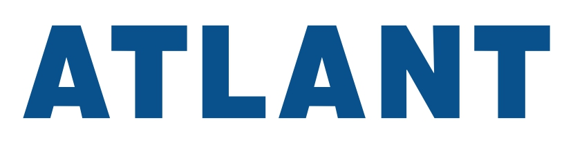
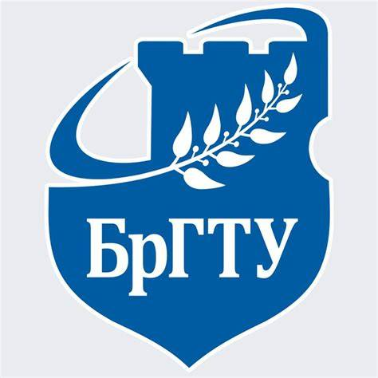
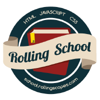
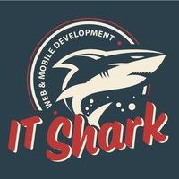

## 1. Full Name

Pavel Halanin


Middle Software Engineer

Work Experience 3 year

(JavaScript, React, React Native, Next.js, Node.js, NestJS, PHP, REST API, SwaggerUI, Docker, Git)

## 2. Contact information

- **Phone**: [+375-33-331-32-03](tel:+375333313203)
- **E-mail**: [pavelhalanin@outlook.com](mailto:pavelhalanin@outlook.com)
- **Discord**: [pavgal](https://discord.com/users/1482615972060991488)
- **GitHub**: [pavelhalanin](https://github.com/pavelhalanin)
- **LinkedIn**: [pavelhalanin](https://www.linkedin.com/in/pavelhalanin/)
- **CodeWars**: [rsschool](https://www.codewars.com/users/rsschool_7f3e087f4b5570c1)
- **WebSite**:
    - [OOO DE-PA](https://www.de-pa.by/)
    - [Kung Consulting](https://www.kungconsulting.com/)

## 3. Brief Self-Introduction

Software Engineer with 3 years of commercial experience, graduated with honors in Software Engineering. Began my career at DE-PA, then joined ATLANT, where I was promoted to Software Engineer 2nd Category within two years. Tech stack: JavaScript, React, React Native, Next.js, Node.js, NestJS, PHP, REST API, SwaggerUI, Docker, Git. Seeking a Middle Software Engineer position in a professional team with opportunities for further growth.

## 4. Skills

- programming languages: JavaScript, PHP8, SQL, TypeScript
- frameworks: React, ReactNative, NextJS, NestJS
- methodologies: ARIS, UML
- version control systems: Git, SVN
- IDE: VS Code
- Package Managers: npm, yarn
- Debugging Tools: Chrome DevTools
- Operating Systems: Windows, Linux
- API Testing: Postman, SwaggerUI
- Markup & Documentation Languages: HTML5, CSS3, MarkDown, LaTeX, JSON
- Databases: MySQL, Oracle, SQLite, DBF
- Containers & Virtualization: Docker, docker-compose
- Design: Figma, Photopea, Adobe Photoshop
- Hosting & Server Management: cPanel, ISPmanager, Hoster.by, Login.by
- AI & Local Models: Ollama
- DevOps & Infrastructure: Apache, WAMP, nginx

## 5. Code Examples

```js
function getCardId(value) {
    const ARRAY_RANK = ['A', '2', '3', '4', '5', '6', '7', '8', '9', '10', 'J', 'Q', 'K'];
    const ARRAY_SUIT = ['♣', '♦', '♥', '♠'];
    const RANK = `${value}`.replace(/[♣♦♥♠]$/, '');
    const SUIT = `${value}`.replace(/[^♣♦♥♠]/g, '');
    const RANK_ID = ARRAY_RANK.indexOf(RANK);
    const SUIT_ID = ARRAY_SUIT.indexOf(SUIT);
    return RANK_ID + 13 * SUIT_ID;
}
```

```js
class Helper {
    static async fetchCompanyData_byUnp(unp) {
        const URL_ = `https://grp.nalog.gov.by/api/grp-public/data?unp=${unp}`;
        const RESPONSE = await fetch(URL_);

        const HTTP_STATUS = RESPONSE.status;
        if (HTTP_STATUS !== 200) {
            const TEXT = await RESPONSE.text();
            throw new Error(`HttpStatus ${HTTP_STATUS}\n${TEXT}`);
        }

        const DATA = await RESPONSE.json();
        return DATA;
    }
}

try {
    const DATA = Helper.fetchCompanyData_byUnp(100582333);
    console.log(DATA);
}
catch(exception) {
    console.error(exception);
}
```

## 6. Work Experience (3 year)

<table>
    <tr>
        <td width="100"></td>
        <td width="800"></td>
    </tr>
    <tr>
        <th colspan="2" align="left">ZAO ATLANT, Minsk (2 year 2 month)</th>
    </tr>
    <tr>
        <td rowspan="2">
            
        </td>
        <td>
            <div><b>2nd category Software Engineer</b></div>
            <div>December 2025 - present</div>
        </td>
    </tr>
    <tr>
        <td>
            <div><b>Software Enginer</b></div>
            <div>June 2024 - December 2025</div>
        </td>
    </tr>
    <tr>
        <th colspan="2" align="left">OOO DE-PA, Brest (1 year)</th>
    </tr>
    <tr>
        <td rowspan="1">
            
        </td>
        <td>
            <div><b>Software Enginer</b></div>
            <div>June 2023 - December 2024</div>
        </td>
    </tr>
</table>

## 7. Education

<table>
    <tr>
        <td>Class C</td>
        <td>🚚</td>
    </tr>
    <tr>
        <td>Class B</td>
        <td>🚗</td>
    </tr>
    <tr>
        <td>Class Am</td>
        <td>🛵</td>
    </tr>
</table>

### Education

<table>
    <tr>
        <td width="100"></td>
        <td width="800"></td>
    </tr>
    <tr>
        <th colspan="2" align="left">
            Brest State Technical University, Brest (4 year)
        </th>
    </tr>
    <tr>
        <td rowspan="2">
            
        </td>
        <td>
            <div>September 2019 - June 2023 (4 year)</div>
        </td>
    </tr>
    <tr>
        <td>
            <div>Diploma of Higher Education with Honors</div>
            <div>
                Specialty: Information Technology Software (Программное обеспечение информационных технологий)
            </div>
            <div>
                Qualification: Software Engineer (инженер-программист)
            </div>
        </td>
    </tr>
</table>

### Courses

<table>
    <tr>
        <td width="100"></td>
        <td width="800"></td>
    </tr>
    <tr>
        <th colspan="2" align="left">
            RS School, Online (0.5 year)
        </th>
    </tr>
    <tr>
        <td rowspan="3">
            
        </td>
        <td>
            <div><b>[Stage 0.5] JS/FE Summer bootcamp 2026Q2</b></div>
            <div>01.06.2026 - 03.09.2026</div>
        </td>
    </tr>
    <tr>
        <td>
            <div><b>[Stage 3] React 2026 Q2</b></div>
            <div>27.04.2026 - 21.07.2026</div>
            <div>
                <a href="https://app.rs.school/certificate/sbwv7urx">
                    Certificate
                </a>
            </div>
            <div>
                <a href="https://app.rs.school/certificate/sbwv7urx">
                    
                </a>
            </div>
        </td>
    </tr>
    <tr>
        <td>
            <div><b>[Stage 0] JS/FE Pre-School 2026 Q1</b></div>
            <div>16.03.2026 - 08.05.2026</div>
        </td>
    </tr>
    <tr>
        <th colspan="2" align="left">IT Shark, Brest</th>
    </tr>
    <tr>
        <td>
            
        </td>
        <td>
            <div>2018 - 2019</div>
            <div>Brest State Technical University</div>
        </td>
    </tr>
</table>

## 8. English Language

### About English

I read, I speak fluently. I've been practicing English for 12 years.

### Other languages

- Russian - native Landuage
- Belarusian - native Landuage
